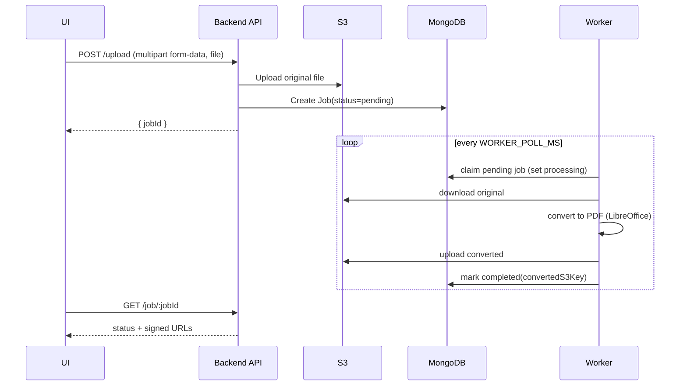

## File Converter Demo (DOC/XLS/CSV → PDF)

Asynchronous file conversion service with a Node/Express backend, MongoDB job queue, an S3-backed storage layer, a background worker that performs LibreOffice conversions, and a React (Vite) web UI.

- **Backend**: Express API, MongoDB via Mongoose, AWS S3 for storage
- **Worker**: Polls jobs, converts with LibreOffice via `libreoffice-convert`
- **UI**: React + Vite single-page app



### Tech Stack
- **Backend/Worker**: Node 20, Express, Mongoose, AWS SDK, `libreoffice-convert`
- **UI**: React 18, Vite, TailwindCSS
- **Infra**: MongoDB (Atlas or local), AWS S3 bucket

### Prerequisites
- Node.js 18+ (Node 20 recommended)
- MongoDB (Atlas URI or local instance)
- AWS S3 bucket and credentials with read/write permissions
- LibreOffice (only required if running the worker on your host; the provided Dockerfile includes it)

---

## Backend
Location: `backend/`

Server listens on `http://localhost:3000`.

### Environment variables
Create `backend/.env` (or use your platform’s secret manager). Example:

```env
MONGODB_URI=mongodb+srv://<user>:<pass>@<cluster>/<db>?retryWrites=true&w=majority
AWS_ACCESS_KEY_ID=YOUR_KEY
AWS_SECRET_ACCESS_KEY=YOUR_SECRET
AWS_REGION=us-east-1
AWS_S3_BUCKET=your-s3-bucket-name

# Optional
WORKER_POLL_MS=20000
```

### Install & run (API server)
```bash
cd backend
npm install
npm run dev
# or: npm start
```

### Run the background worker
The worker polls pending jobs and performs conversions.

```bash
cd backend
npm run dev:worker
# or: npm run worker
```

### Docker (worker)
The provided `backend/Dockerfile` builds a worker image (starts the worker by default):

```bash
cd backend
docker build -t file-converter-worker .
docker run --rm \
  --env-file .env \
  file-converter-worker
```

Note: The API server is started separately (outside the worker container). Ensure the API and worker share the same MongoDB and AWS credentials.

### API
- `POST /upload` — multipart form-data with field name `file`; creates a job
- `GET /job/:jobId` — returns job status and (when available) signed URLs for original and converted files

Sample usage:
```bash
# 1) Upload a file
curl -F "file=@/absolute/path/to/document.docx" http://localhost:3000/upload
# => { "jobId": "<id>", ... }

# 2) Poll for status
curl http://localhost:3000/job/<id>
```

Response shape (example):
```json
{
  "_id": "663...",
  "status": "completed",
  "message": null,
  "originalFileUrl": "https://...signed...",
  "convertedFileUrl": "https://...signed..."
}
```

---

## Web UI
Location: `ui/`

### Configure API base URL
Set the backend URL in `ui/src/global/server.js`:

```js
// export const serverUrl = "http://localhost:3000";
export const serverUrl = "https://file-converter-demo-backend.onrender.com";
```

For local development, uncomment the localhost line and comment the production line.

### Install & run (UI)
```bash
cd ui
npm install
npm run dev
```

Build & preview:
```bash
npm run build
npm run preview
```

---

## Quickstart (local)
1) Prepare `backend/.env` with MongoDB and AWS settings.
2) Start the API: `cd backend && npm run dev`.
3) Start the worker: `cd backend && npm run dev:worker`.
4) Point the UI to the API (`ui/src/global/server.js`), then `cd ui && npm run dev`.
5) Upload a `.doc/.docx/.xls/.xlsx/.csv` file from the UI and wait for conversion.

Supported inputs: `.doc`, `.docx`, `.xls`, `.xlsx`, `.csv`. Output: `.pdf`.

---

## Troubleshooting
- Missing `AWS_S3_BUCKET` or bad credentials will prevent uploads or signed URL generation.
- If conversions fail locally, ensure LibreOffice is installed and accessible in PATH (or run the worker via Docker).
- Ensure `MONGODB_URI` is reachable from both API and worker processes.

---

## Scripts reference
Backend (`backend/package.json`):
- `dev`: start API with nodemon
- `start`: start API
- `dev:worker`: start worker with nodemon
- `worker`: start worker

UI (`ui/package.json`):
- `dev`: Vite dev server
- `build`: production build
- `preview`: preview build
- `lint`: run ESLint

---

## License
ISC


